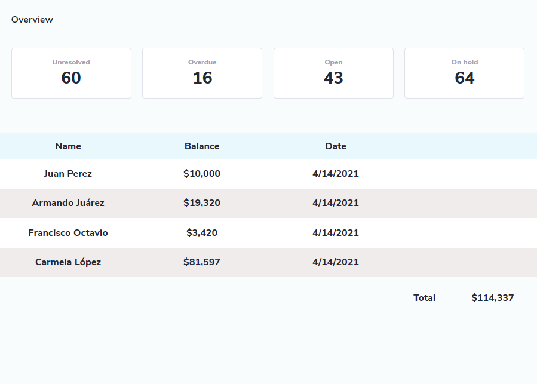

# CREATION DATE

    Lunes, 12 ABRIL 2021 [04:36 AM]

# FINISHING DATE

    Thursday, April 12th, 2021 [12:45PM]

# FILES "T2_1 - PANTALLA A MAQUETAR/"

    - Desktop - 1.pdf <- WEBSITE LAYOUT WITHOUT INSTRUCTIONS.

    - Desktop - 3.pdf <- WEBSITE LAYOUT WITH GRAPHIC INSTRUCTIONS.

# LAYOUT

## OBJECTIVE LAYOUT

<!-- LOS SIGNOS DE AMIRACIÓN SON PARA QUE SE MUESTREN LAS IMÁGENES, DE OTRA
     FORMA, SE PONDRÍAN COMO ENLACES AL CONRENIDO ESPECÍFICADO. -->

## LAYOUT I MADE
    

<!-- LA IMAGEN DEBE DE IR AQUÍ, SI NO, NO SE VA A MOSTRAR. También debe llevar
     el signo de admiración para que se muestre. -->

# PARTS

## 1.- PRIMERA PARTE: MAQUETACIÓN
    
        - Cards: Flex, Justify Content

## 2.- SEGUNDA PARTE: JavaScript

### 2.1.-  STEPS
        1. Crear elementos con JS.
        2. Poner CSS con JS.
        3. Elementos de texto con JS.
        4. Utilizar Flex para la separación.

### 2.2.- INSTRUCTIONS

        - Podemos modificar los elementos de la página.

        - El elemento del total deberá obtener la suma de los valores en "Balance".

        - Solo se permitirá un contenedor.
        
# GENERAL INSTRUCTIONS

    - Nada demasiado llamativo.
    - Todo hacerlo en un mismo archivo.
    - Estilos de JS puestos por JS no los quiere en el CSS.
    - NO UTILIZAR BIBLIOTECAS EXTERNAS.

# DELIVERY DATE
    
    Lunes, 12 ABRIL <- PARA ANTES DE LA CLASE.
